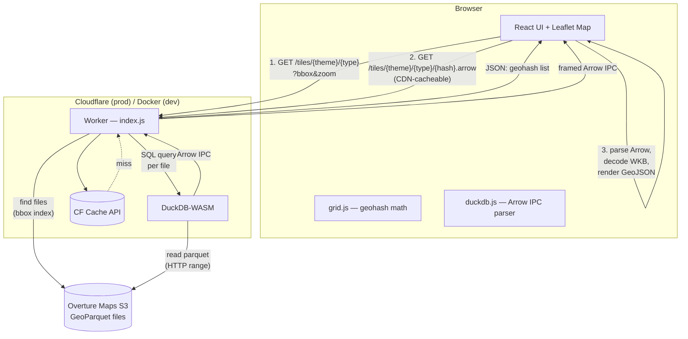
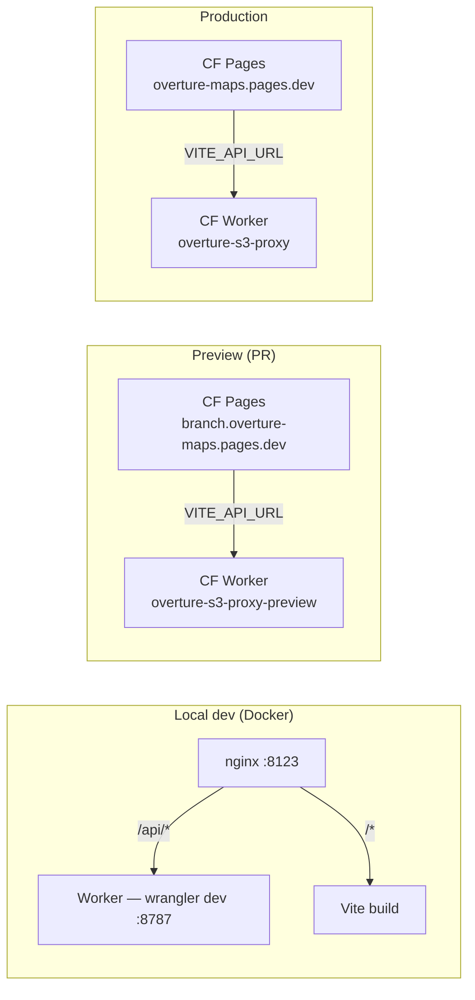

# Overture Maps Browser

Browser-based viewer for [Overture Maps](https://overturemaps.org/) data. A Cloudflare Worker runs DuckDB-WASM to query GeoParquet files on S3, returning Arrow IPC tiles that the browser renders on a Leaflet map.

## Architecture



### Data flow in detail

1. **Tile list** — browser sends viewport bbox + zoom to worker. Worker computes geohash cells covering the viewport and returns them as a JSON array.

2. **Tile data** — browser fetches each geohash tile individually (`/{hash}.arrow`). These URLs are deterministic and CDN-cacheable (30-day `Cache-Control`). For each tile the worker:
   - Decodes geohash to a bounding box
   - Finds overlapping parquet files using a cached spatial index (parquet row-group statistics)
   - Runs a DuckDB SQL query per file with a bbox WHERE clause
   - Returns results as framed Arrow IPC: `[4-byte LE length][Arrow IPC bytes]` per frame

3. **Render** — browser parses Arrow frames with [Flechette](https://github.com/uwdata/flechette), decodes WKB geometry, and renders GeoJSON features on the Leaflet map.

### Worker endpoints

| Endpoint | Method | Description |
|----------|--------|-------------|
| `/releases` | GET | List available Overture Maps releases |
| `/themes?release=X` | GET | List theme/type pairs for a release |
| `/files?release&theme&type[&bbox]` | GET | List parquet files, optionally filtered by bbox |
| `/tiles/{theme}/{type}?release&bbox&zoom` | GET | Geohash tile list for viewport |
| `/tiles/{theme}/{type}/{hash}.arrow?release` | GET | Tile data as framed Arrow IPC |
| `/query` | POST | Ad-hoc multi-file streaming query |
| `/query/exec` | POST | Single-file query (Arrow IPC response) |
| `/release/**` | * | S3 passthrough proxy |

## Environments



| | Local | Preview (PR) | Production |
|---|---|---|---|
| **Frontend** | `http://localhost:8123` | `https://{branch}.overture-maps.pages.dev` | `https://overture-maps.pages.dev` |
| **Worker** | `http://localhost:8787` (via nginx `/api/`) | `https://overture-s3-proxy-preview.zarbazan.workers.dev` | `https://overture-s3-proxy.zarbazan.workers.dev` |
| **API routing** | nginx proxies `/api/*` to worker | `VITE_API_URL` baked at build | `VITE_API_URL` baked at build |
| **Cache** | No CF cache (local) | CF edge cache | CF edge cache (30-day tiles) |
| **Deploy** | `docker compose up` | Push to PR branch | Merge to `master` |

## Local development

Everything runs in Docker — including the worker with DuckDB-WASM:

```bash
docker compose up
```

Open `http://localhost:8123` (or `http://<hostname>:8123` if working via SSH).

### What happens

- **ui** container: runs `npm install && npm run build`, outputs static files to a shared volume
- **worker** container: runs `npx vite build && npx wrangler dev --local` on port 8787 with DuckDB-WASM
- **web** (nginx) container: serves static files on port 8123, proxies `/api/*` to the worker

### Rebuilding after changes

```bash
# Rebuild worker only (e.g. after editing worker/src/index.js)
docker compose up -d --force-recreate worker

# Rebuild frontend only (e.g. after editing src/)
docker compose up -d --force-recreate ui

# Rebuild everything
docker compose up -d --force-recreate
```

### Worker-only development (no Docker)

```bash
# Terminal 1: worker
cd worker && npm install && npx vite dev

# Terminal 2: frontend
npm install && npm run dev
```

Set `VITE_API_URL=http://localhost:8787` when running the frontend dev server, or requests will go to `/api` which won't exist without nginx.

## Deployment

CI/CD is handled by `.github/workflows/deploy.yml`.

### On PR push

1. Builds worker, deploys as `overture-s3-proxy-preview`
2. Builds frontend with `VITE_API_URL` pointing to the preview worker
3. Deploys frontend to CF Pages preview (`{branch}.overture-maps.pages.dev`)
4. Comments preview + worker URLs on the PR

### On merge to master

1. Builds worker, deploys as `overture-s3-proxy` (production)
2. Builds frontend with `VITE_API_URL` pointing to the production worker
3. Deploys frontend to CF Pages production

### Manual deploy

```bash
# Deploy worker
cd worker
npx vite build
npx wrangler deploy --config dist/overture_s3_proxy/wrangler.json

# Deploy frontend
VITE_API_URL=https://overture-s3-proxy.zarbazan.workers.dev npm run build
npx wrangler pages deploy dist --project-name=overture-maps
```

## Project structure

```
overturemaps-duckdb/
├── src/
│   ├── main.jsx                  # Entry point
│   ├── react/App.jsx             # React UI (sidebar, controls)
│   └── lib/
│       ├── constants.js          # PROXY URL, theme colors, field definitions
│       ├── grid.js               # Geohash encode/decode, viewport tiling
│       ├── themes.js             # Theme loading orchestrator (tile list → tile data → render)
│       ├── duckdb.js             # Arrow IPC parser (query, queryTile)
│       ├── map.js                # Leaflet map setup
│       ├── render.js             # GeoJSON feature rendering
│       ├── wkb.js                # WKB geometry decoder
│       ├── query.js              # Legacy query builder
│       ├── store.js              # Zustand state
│       ├── controller.js         # UI ↔ map coordination
│       ├── snapviews.js          # Saved map positions
│       └── intersections.js      # Spatial intersection checks
├── worker/
│   ├── src/index.js              # CF Worker: S3 proxy, tile endpoints, DuckDB queries
│   ├── vite.config.js            # Vite + Cloudflare + DuckDB plugins
│   ├── wrangler.jsonc            # Worker config
│   └── Dockerfile                # Dev container
├── docker-compose.yml            # Local dev: nginx + worker + ui
├── nginx.conf                    # Dev proxy config
├── .github/workflows/deploy.yml  # CI/CD pipeline
├── vite.config.js                # Frontend Vite config
└── package.json
```
